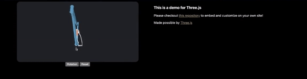

</img>

# Render CAD on your website! 
| Have you ever wanted to show your amazing 3D designs off on your personal site? 

Thanks to the work on Three.js, this is now super easy to do! 

</img>

I made a working template for my own site that might help you get started on yours!

Here are some reasons why you might want to do this:
1. You want to show off your CAD designs on your site
2. You can modify lights, camera, and other settings to make your design look better
3. You can add interactivity to your design

Other benefits include that it uses javascript and imports its libraries from a CDN, so it's easy to get started and doesn't require any server-side code.

## Integration
1. You will need main.js from this repo
2. You will need to add the following to your HTML file:
```html
<head>  
        <!-- You need this CSS import for style-points -->
        <link rel="stylesheet" href="styles.css">
    </head>

    <!-- You need these javascript imports -->
    <script  type="importmap">{
        "imports": {
            "three": "https://threejs.org/build/three.module.js",
            "three/addons/": "https://threejs.org/examples/jsm/"
        }}
    </script>
    <script type="module" src="main.js"></script>
    
    
    <body>

        <!-- Below is the container which has 1/2 model, 1/2 text -->
        <div id="3D-model-container"></div>
                <div id="left">
                    <center> 
                    <canvas id="c"></canvas>
                    <div id="controlPanel">
                        <button id="startStop">Rotation</button>
                        <button id="reset">Reset</button>
                    </div>
                    </center>
                </div>
                <div id="right">
                    <p>Made possible by <a href="https://threejs.org/">Three.js</a></p>
                </div>
                <p>
        </div>

        <!-- End of the useful container-->
```
3. Export a .GLTF model from your CAD program of choice
4. Edit the following line in your main.js file to point to your .GLTF file:
```javascript
 // !!!HERE YOU CAN REPLACE THE MODEL WITH YOUR OWN!!!
    gltfLoader.load("bike.gltf", (gltf) => {
```
5. You can now view your model on your site!

## To-Do List:
- [x] Figure out how to a basic rendering of Three.js working
- [x] Figure out how to get a CAD model/assembly imported with color 
- [x] Figure out controls
- [x] Write docs 
- [ ] Figure out how to get it to work on mobile

Any suggestions please feel free to make a pull request or open an issue! Thanks!